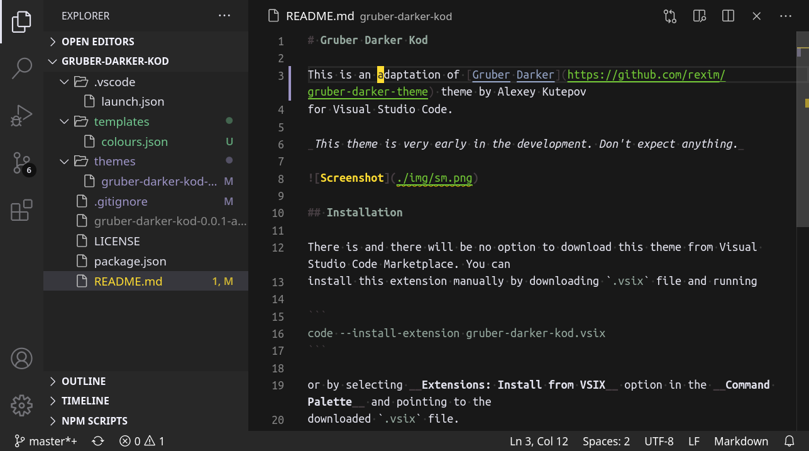

# Gruber Darker Kod

This is an adaptation of [Gruber Darker](https://github.com/rexim/gruber-darker-theme) theme by Alexey Kutepov
for Visual Studio Code.

_This theme is very early in the development. Don't expect anything._



## Installation

There is and there will be no option to download this theme from Visual Studio Code Marketplace. You can
install this extension manually by downloading `.vsix` file and running

```
code --install-extension gruber-darker-kod.vsix
```

or by selecting __Extensions: Install from VSIX__ option in the __Command Palette__ and pointing to the
downloaded `.vsix` file.

You can also clone this repository and build the extension yourself.